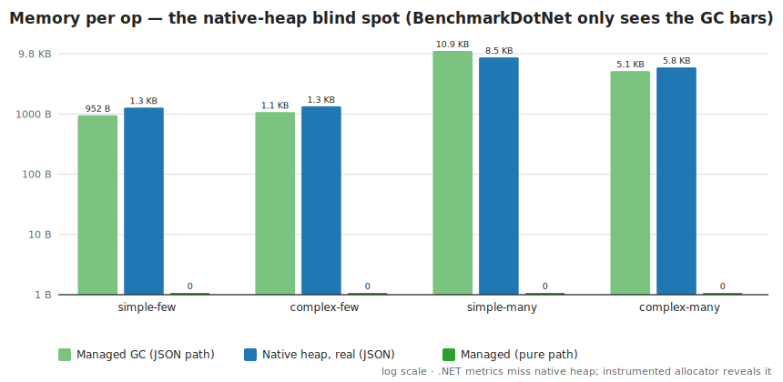

# Zen Expression Language — Managed vs Native (.NET interop) comparison

A from-scratch implementation of the [GoRules ZEN expression language](https://docs.gorules.io/learn/zen-language/syntax)
evaluated **three ways**, benchmarked to answer one question:

> **Does the raw speed of unmanaged (Rust) code offset the cost of .NET interop
> against a genuinely performant pure-managed (C#) implementation?**

The three engines, all evaluating the *same* Zen subset:

| Engine | What it is |
| --- | --- |
| **`Zen.Managed`**   | Pure C# implementation (lexer, Pratt parser, struct-based evaluator). **The managed library under test.** |
| **`Zen.Native` + `Zen.Interop`** | A manual Rust `cdylib` implementing the same subset, called via my own P/Invoke wrapper. A clean "native eval speed + minimal interop" probe. Its global allocator is instrumented, so its **native heap is measurable**. |
| **`GoRules.Zen`** (NuGet) | The **official** native Rust engine shipped to .NET via UniFFI — the real-world "unmanaged engine via interop" path. |

`Zen.Tests` proves all three agree on a battery of expressions (managed↔native,
managed↔official). `Zen.Benchmarks` measures throughput and memory.

## TL;DR — does native win?

**No, not at this granularity.** A performant managed implementation matches or
beats both native engines for every expression size tested, because:

1. **Raw P/Invoke is cheap (~6.8 ns/call)** — but it is *not* the dominant cost.
   The cost is **marshalling**: the native engines must serialize the context to
   JSON, cross the boundary, and serialize the result back. That is µs-scale and
   dominates ns-scale expression work.
2. The official **`GoRules.Zen` pays a ~4 µs floor on every call** (async `Task`
   + thread-pool dispatch + full JSON context round-trip), so it is **20–34×
   slower** than managed pure-eval regardless of expression size. Its API offers
   no "pre-compiled / pre-parsed context" fast path.
3. The **managed hot path allocates zero GC bytes** (discriminated `struct`
   values hold arrays/objects *by reference*). The native engines allocate on a
   **hidden native heap that .NET metrics cannot see** — a memory-accountability
   trap, not an advantage.

The crossover where native *would* pay off requires per-call work large enough
to amortize the fixed marshalling cost — i.e. either enormous expressions or
many evaluations batched inside a single native call. Single-expression calls of
realistic size do not reach it.

## Results at a glance





*(Regenerate with `python3 scripts/generate_charts.py`; numbers transcribed from
[`results/bench-full.txt`](results/bench-full.txt). AMD Ryzen 9 5900X, .NET 8.0.28.)*

## Repository layout

```
src/Zen.Managed/      Pure C# engine (the library)
native/zen-native/    Rust cdylib (manual native engine + counting allocator)
src/Zen.Interop/      P/Invoke wrapper over libzen_native
src/Zen.Gorules/      Adapter over the official GoRules.Zen NuGet package
src/Zen.Tests/        xUnit parity (managed↔native 208, managed↔GoRules 69) — all green
src/Zen.Benchmarks/   BenchmarkDotNet suite + standalone --mem / --probe reports
docker/Dockerfile     Multi-stage build (Rust + .NET 8, Ubuntu 24.04 noble for glibc 2.39)
Zen.sln
```

## Build & run (Docker only)

```bash
docker build -t zen-dev -f docker/Dockerfile .

# C# iteration does NOT need an image rebuild (source is bind-mounted):
docker run --rm -v "$PWD":/work -w /work zen-dev dotnet build  Zen.sln -c Release
docker run --rm -v "$PWD":/work -w /work zen-dev dotnet test   src/Zen.Tests -c Release
docker run --rm -v "$PWD":/work -w /work zen-dev dotnet run    -c Release --project src/Zen.Benchmarks             # throughput
docker run --rm -v "$PWD":/work -w /work zen-dev dotnet run    -c Release --project src/Zen.Benchmarks -- --mem    # memory
docker run --rm -v "$PWD":/work -w /work zen-dev dotnet run    -c Release --project src/Zen.Benchmarks -- --probe  # 3-engine sanity
```

> The official `GoRules.Zen` native lib (`libzen_ffi.so`) requires **GLIBC 2.39**,
> so the image is Ubuntu 24.04 *noble* (the default `sdk:8.0` Debian image only
> has 2.36 and the lib fails to load).

## Results

Hardware: AMD Ryzen 9 5900X, .NET 8.0.28, Linux container. Full output:
[`results/bench-full.txt`](results/bench-full.txt). (4 scenarios = simple/complex ×
few/many input parameters.)

### Evaluation throughput (lower is better)

| Scenario | Managed pure | Native pure (manual) | GoRules (official) | Managed JSON | Native JSON (manual) | GoRules JSON |
| --- | ---: | ---: | ---: | ---: | ---: | ---: |
| simple-few   | **152 ns** | 470 ns (3.1×) | 3 918 ns (25.7×) | 1 096 ns | 975 ns | 4 400 ns |
| complex-few  | **309 ns** | 575 ns (1.9×) | 6 293 ns (20.4×) | 1 612 ns | **1 317 ns** | 6 540 ns |
| simple-many  | **2 412 ns** | 2 561 ns (1.1×) | 62 161 ns (25.8×) | 10 875 ns | 10 558 ns | 68 307 ns |
| complex-many| **2 167 ns** | 2 213 ns (1.0×) | 67 466 ns (31.1×) | 6 265 ns | **5 086 ns** | 73 762 ns |

Takeaways:
- **Pure-eval (compile-once / eval-many):** managed is fastest and ties manual-native
  on the "many" cases; manual-native loses only on tiny expressions where the fixed
  result-marshalling cost dominates the ~150 ns of work.
- **JSON-eval (parse context + eval, the realistic per-call path):** managed and
  manual-native are within a few percent. GoRules is **20–34× slower** because its
  `Evaluate<T>` API is async + always serializes the context object + dispatches to
  the thread pool.

### Parse / compile (lower is better)

| Scenario | Managed | Native (manual) |
| --- | ---: | ---: |
| simple-few    | **528 ns** | 751 ns (1.4×) |
| complex-few   | **1 576 ns** | 2 101 ns (1.3×) |
| simple-many   | **5 773 ns** | 10 668 ns (1.8×) |
| complex-many  | **7 655 ns** | 11 718 ns (1.5×) |

Managed parsing is faster across the board (fewer allocations, no interop).

### Interop boundary (isolated P/Invoke cost)

| Method | Mean |
| --- | ---: |
| Managed add (inlined) | ~0 ns |
| Native `zen_add` (one P/Invoke) | **6.8 ns** |

So the boundary itself costs ~7 ns. That is *not* what slows the native engines down.

### Memory — and the native-heap blind spot (per op)

BenchmarkDotNet's `Allocated` column is **GC-heap only**. It makes the native
engines look nearly allocation-free, which is misleading. The `--mem` report uses
the instrumented allocator in the manual native lib to show the *real* picture:

| Path | Managed GC B/op | Native heap B/op | Real B/op |
| --- | ---: | ---: | ---: |
| pure-eval (any)             | **0** | ~140 | ~140 |
| json-eval simple-many       | 11 192 | 8 732 | ~19 900 |
| json-eval complex-many      | 5 184  | 5 962 | ~11 100 |
| parse simple-many           | 20 944 | 13 828 | ~34 800 |

- On the **pure** hot path managed allocates **nothing**; native still allocates the
  result buffer + bookkeeping (~140 B). Managed wins decisively.
- On the **JSON** path, native pushes most allocation onto its **hidden heap** — BDN
  reports only ~150–560 managed B/op for native-json, but the *real* footprint
  (~6–9 KB/op of serde-parsed context) only shows up via the counting allocator.
  **Don't trust GC-only numbers to compare against native code.**
- Native heap retained after 20 000 evals: **0 bytes** — no leaks; everything
  transient is freed.

## Analysis: where native *could* win, and why it doesn't here

A native engine wins when **per-call native CPU work ≫ fixed interop + marshalling
cost**. Here the marshalling floor (result JSON round-trip ≈ hundreds of ns for
the manual path; async + context-serialize ≈ ~4 µs for GoRules) is comparable to
or larger than the expression work itself (150 ns–2.4 µs). So the managed JIT —
already very fast on arithmetic and dictionary lookups, and allocating zero on the
hot path — matches or beats native.

Native becomes attractive when you (a) make expressions large enough that real
compute dominates, or (b) **batch** many evaluations per interop call so the
marshalling is amortized. Single-expression evaluation calls of realistic size do
not clear that bar — which is the whole point of this comparison.

## Language subset

Implements standard-mode Zen: number/string/bool/null/array/object literals,
arithmetic (`+ - * / % ^`), comparisons, `and/or/not` (and `&& || !`), ternary,
`??`, member/index access (with negative indices and optional-chaining), `in` /
`not in` with ranges (`[a..b]`, `(a..b]`, …), and ~30 built-ins including
closures via `#` (`map`, `filter`, `some`, `all`, `sum`, …). Operator precedence
follows the published GoRules table. Precedence is exercised by the parity suite
against the official engine. Out of scope: template/backtick strings, string
slicing, assignment statements, decision-graph (JDM) evaluation.
