# Zen Expression Language — Managed vs Native (.NET interop) comparison

A from-scratch implementation of the [GoRules ZEN expression language](https://docs.gorules.io/learn/zen-language/syntax)
evaluated **four ways**, benchmarked to answer one question:

> **Does the raw speed of unmanaged (Rust) code offset the cost of .NET interop
> against a genuinely performant pure-managed (C#) implementation?**

The README is in three parts:

- **[Part 1 — Initial implementation](#part-1--initial-implementation-managed-vs-native-benchmarks):**
  the original managed-vs-native benchmark study (throughput, parse, interop, memory, charts, analysis).
- **[Part 2 — Variants & features](#part-2--variants--features):** everything added
  on top — the four engines, deterministic resource limits (+ an
  enforcement-overhead optimization), cold-start/footprint overhead, strict-compat
  mode, and test coverage.
- **[Part 3 — Second official binding](#part-3--second-official-binding-goruleszenengine):**
  adding `GoRules.ZenEngine` — does the official engine's 20–34× gap live in the
  engine or the binding? (Spoiler: the binding.)

Four engines, all evaluating the *same* Zen subset:

| Engine | What it is |
| --- | --- |
| **`Zen.Managed`**   | Pure C# implementation (lexer, Pratt parser, struct-based evaluator). **The managed library under test.** |
| **`Zen.Native` + `Zen.Interop`** | A manual Rust `cdylib` implementing the same subset, called via my own P/Invoke wrapper. A clean "native eval speed + minimal interop" probe. Its global allocator is instrumented, so its **native heap is measurable**. |
| **`GoRules.Zen`** (NuGet) | An **official** native Rust engine shipped to .NET via UniFFI — async `Evaluate<T>` that re-parses the expression and re-serializes the context every call. The legacy "unmanaged engine via interop" path. |
| **`GoRules.ZenEngine`** (NuGet) | A **second official** .NET binding of the *same* Rust core — newer, with a **synchronous, precompiled** `ZenExpression.Compile` + `JsonBuffer` API (the fast path `GoRules.Zen` lacks). Added to test whether the 20–34× gap is the *engine* or the *binding*. |

`Zen.Tests` proves all four agree on a battery of expressions (managed↔native,
managed↔each official binding). `Zen.Benchmarks` measures throughput and memory.

## TL;DR — does native win?

**No, not at this granularity.** A performant managed implementation matches or
beats every native binding for every expression size tested, because:

1. **Raw P/Invoke is cheap (~6.8 ns/call)** — but it is *not* the dominant cost.
   The cost is **marshalling**: the native engines must serialize the context to
   JSON, cross the boundary, and serialize the result back. That is µs-scale and
   dominates ns-scale expression work.
2. The legacy **`GoRules.Zen` pays a ~4 µs floor on every call** (async `Task`
   + thread-pool dispatch + full JSON context round-trip), so it is **20–34×
   slower** than managed pure-eval. Its API offers no "pre-compiled / pre-parsed
   context" fast path. **The newer `GoRules.ZenEngine` binding fixes both**:
   `ZenExpression.Compile` amortizes the parse and `Evaluate(JsonBuffer)` is
   synchronous — it closes most of the gap (**~3–12× faster than `GoRules.Zen`**)
   yet still trails managed, because the context is still JSON bytes parsed every
   call (managed holds it as a live in-process object). On heavy scalar work it
   lines up with managed's *JSON* path, not its pure path. The slowness was the
   *binding*, not the engine — but a native binding can never skip the context
   serialization that a managed engine structurally avoids.
3. The managed hot path allocates **zero GC bytes for scalar-producing
   expressions**
3. The managed hot path allocates **zero GC bytes for scalar-producing
   expressions** (condition evaluation — discriminated `struct` values hold
   arrays/objects *by reference*). Expressions that *reshape* data (`map`,
   object literals, string building) do allocate — 264–824 B/op here — but still
   less than the native engines, which allocate on a **hidden native heap that
   .NET metrics cannot see**. That hidden heap is a memory-accountability trap,
   not an advantage.

The crossover where native *would* pay off requires per-call work large enough
to amortize the fixed marshalling cost — i.e. either enormous expressions or
many evaluations batched inside a single native call. Single-expression calls of
realistic size do not reach it.

## Repository layout

```
src/Zen.Managed/      Pure C# engine (the library)
native/zen-native/    Rust cdylib (manual native engine + counting allocator)
src/Zen.Interop/      P/Invoke wrapper over libzen_native
src/Zen.Gorules/      Adapter over the official GoRules.Zen NuGet package
src/Zen.ZenEngine/    Adapter over the official GoRules.ZenEngine NuGet package (2nd binding)
src/Zen.Tests/        xUnit parity + limits (374 tests) — all green
src/Zen.Benchmarks/   BenchmarkDotNet suite + standalone --mem / --overhead / --probe reports
docker/Dockerfile     Multi-stage build (Rust + .NET 8, Ubuntu 24.04 noble for glibc 2.39)
Zen.sln
```

## Build & run (Docker only)

```bash
docker build -t zen-dev -f docker/Dockerfile .

# C# iteration does NOT need an image rebuild (source is bind-mounted):
docker run --rm -v "$PWD":/work -w /work zen-dev dotnet build  Zen.sln -c Release
docker run --rm -v "$PWD":/work -w /work zen-dev dotnet test   src/Zen.Tests -c Release
docker run --rm -v "$PWD":/work -w /work zen-dev dotnet run    -c Release --project src/Zen.Benchmarks             # throughput
docker run --rm -v "$PWD":/work -w /work zen-dev dotnet run    -c Release --project src/Zen.Benchmarks -- --mem        # memory (incl. native heap)
docker run --rm -v "$PWD":/work -w /work zen-dev dotnet run    -c Release --project src/Zen.Benchmarks -- --overhead   # cold-start + footprint
docker run --rm -v "$PWD":/work -w /work zen-dev dotnet run    -c Release --project src/Zen.Benchmarks -- --probe     # 3-engine sanity

# strict compat (fail on unexpected GoRules divergences; default is lenient):
docker run --rm -e ZEN_STRICT_COMPAT=1 -v "$PWD":/work -w /work zen-dev dotnet test src/Zen.Tests -c Release
```

> The official `GoRules.Zen` native lib (`libzen_ffi.so`) requires **GLIBC 2.39**,
> so the image is Ubuntu 24.04 *noble* (the default `sdk:8.0` Debian image only
> has 2.36 and the lib fails to load).

---

# Part 1 — Initial implementation: managed vs native benchmarks

The original study: the same Zen subset evaluated four ways (the fourth,
`GoRules.ZenEngine`, added in Part 3), measured on throughput, parse, interop and
memory across simple/complex × few/many parameters, plus allocating
(data-reshaping) expressions for fairness.

## Detailed results

Hardware: AMD Ryzen 9 5900X, .NET 8.0.28 (GoRules.Zen 0.5.0 / GoRules.ZenEngine 0.7.2), Linux container. Full output:
[`results/bench-full.txt`](results/bench-full.txt). 7 scenarios: the first four are
scalar-producing (simple/complex × few/many); the last three are **allocating /
data-reshaping** (`map` → array, object literal, string building). Charts are
generated by `python3 scripts/generate_charts.py`; figures vary a few % run-to-run.

### Evaluation throughput (lower is better)

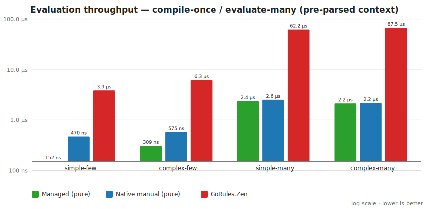

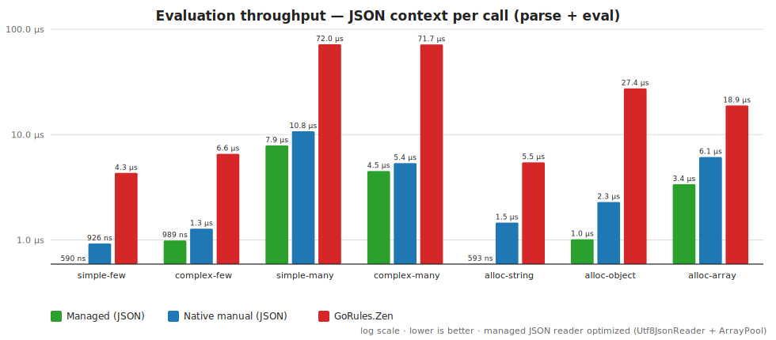

**Pure-eval** (compile-once / pre-parsed context) — ns/op, lower is better (bold = row winner):

| Scenario | Managed | Native (manual) | GoRules.Zen | GoRules.ZenEngine |
| --- | ---: | ---: | ---: | ---: |
| simple-few    | **132** | 248 | 3 716 | 1 194 |
| complex-few   | **285** | 334 | 6 571 | 1 631 |
| simple-many   | 2 125 | **2 070** | 59 197 | 8 835 |
| complex-many  | 2 030 | **1 787** | 62 367 | 5 396 |
| alloc-string  | **302** | 682 | 4 749 | 1 361 |
| alloc-object  | **606** | 1 854 | 36 093 | 3 752 |
| alloc-array   | **1 976** | 3 997 | 21 826 | 6 288 |

**JSON-eval** (parse context per call) — ns/op:

| Scenario | Managed | Native (manual) | GoRules.Zen | GoRules.ZenEngine |
| --- | ---: | ---: | ---: | ---: |
| simple-few    | **547** | 657 | 4 412 | 1 285 |
| complex-few   | **978** | 993 | 7 646 | 1 726 |
| simple-many   | **7 084** | 9 413 | 63 891 | 8 342 |
| complex-many  | **4 409** | 4 634 | 65 884 | 5 359 |
| alloc-string  | **599** | 1 197 | 5 825 | 1 441 |
| alloc-object  | **1 055** | 1 809 | 32 195 | 2 966 |
| alloc-array   | **3 151** | 4 927 | 26 311 | 6 799 |

Takeaways:
- **Managed wins almost every cell** (manual-native edges it on `simple-many` and
  `complex-many` pure, within run-to-run noise). On pure-eval the two are close on
  the largest scalar expressions and managed beats native by ~2–3× on the
  allocating ones.
- **`GoRules.ZenEngine` closes most of `GoRules.Zen`'s gap** — it is **~3–12×
  faster** than the legacy `GoRules.Zen` on every scenario, because it compiles the
  expression once (`ZenExpression.Compile`) and evaluates **synchronously**
  (`Evaluate(JsonBuffer)`, no async/thread-pool floor). Yet it still trails
  managed: ZenEngine's "pure" path parses the JSON context every call (the context
  is raw `JsonBuffer` bytes), so it lines up with managed's *JSON* path, not its
  pure path. The 20–34× penalty was the *binding's* design (async + no
  precompile), not the engine — but no native binding can skip the context
  serialization a managed engine structurally avoids.
- **Allocating expressions are the honest case:** managed pure-eval is *not*
  zero-alloc here (it builds the result array/object/string) — see the memory
  table — yet it still leads on both speed and allocation.
- **JSON-eval** (parse context + eval): managed and manual-native are within a few
  percent on scalars; `GoRules.ZenEngine` is competitive with managed on large
  contexts (its Rust `serde` is fast — `simple-many` JSON 8.3 µs vs managed 7.1
  µs), while legacy `GoRules.Zen` lags far behind.

#### Fairness: how each engine ingests context

The two paths measure two realistic regimes, and the cost each engine pays is a
real capability difference, not a measurement artifact:

- **JSON-string path (`*_Json`)** — all engines start from the *same raw JSON string*
  and must parse it. Managed parses once (UTF-16 `ZenJson` → `ZenValue`); the manual
  native binding takes raw bytes and parses once (serde); **`GoRules.ZenEngine` takes
  a `JsonBuffer` of raw bytes** (no managed-side object serialization); the **legacy
  `GoRules.Zen` binding takes a context *object* and `JsonSerializer.Serialize`s it on
  every call**, so from a JSON string it pays parse + serialize + native parse.
  Same input; the difference is each binding's real API cost.
- **Pre-parsed path (`*_Pure`)** — managed and manual-native can **cache a parsed
  context** (a `ZenValue` / a native context handle) and evaluate with **no per-call
  JSON**. `GoRules.ZenEngine` **precompiles the expression** (`ZenExpression.Compile`,
  reused) and reuses a `JsonBuffer` — but the *context is still raw bytes parsed by
  Rust every call*; it cannot hold a parsed context. Legacy `GoRules.Zen` re-parses
  *both* the expression and a serialized context every call. So `ZenEngine_Pure`
  benchmarks like a JSON path that amortizes parse-of-expression, not like managed's
  true pure path.

This is the whole point of the comparison: a managed engine can hold the context as
a **live in-process object** and skip serialization entirely, which native engines
structurally cannot — they must serialize any object to cross the boundary.
`GoRules.ZenEngine` removes the *binding's* taxes (async dispatch, per-call compile)
but not this structural one.

### Parse / compile (lower is better)

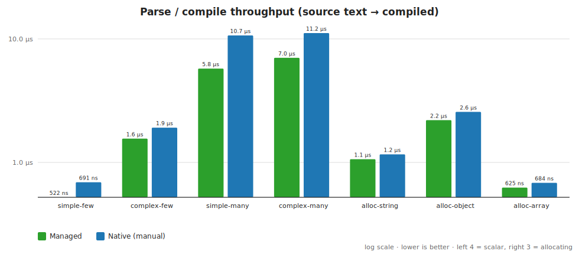

| Scenario | Managed | Native (manual) |
| --- | ---: | ---: |
| simple-few    | **522 ns** | 691 ns (1.3×) |
| complex-few   | **1 558 ns** | 1 913 ns (1.2×) |
| simple-many   | **5 751 ns** | 10 674 ns (1.9×) |
| complex-many  | **7 025 ns** | 11 150 ns (1.6×) |
| alloc-string  | **1 062 ns** | 1 163 ns (1.1×) |
| alloc-object  | **2 200 ns** | 2 566 ns (1.2×) |
| alloc-array   | **625 ns** | 684 ns (1.1×) |

Managed parsing is faster across the board (fewer allocations, no interop).

### Interop boundary (isolated P/Invoke cost)

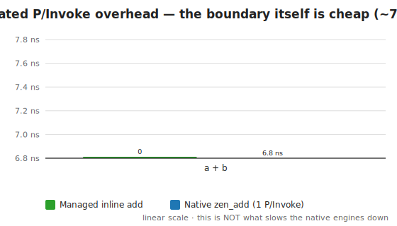

| Method | Mean |
| --- | ---: |
| Managed add (inlined) | ~0 ns |
| Native `zen_add` (one P/Invoke) | **6.8 ns** |

So the boundary itself costs ~7 ns. That is *not* what slows the native engines down.

### Memory — and the native-heap blind spot (per op)

BenchmarkDotNet's `Allocated` column is **GC-heap only**. It makes the native
engines look nearly allocation-free, which is misleading. The `--mem` report uses
the instrumented allocator in the manual native lib to show the *real* picture:

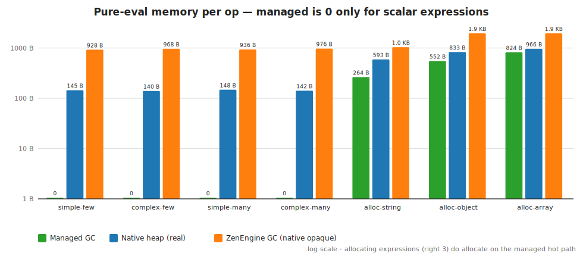

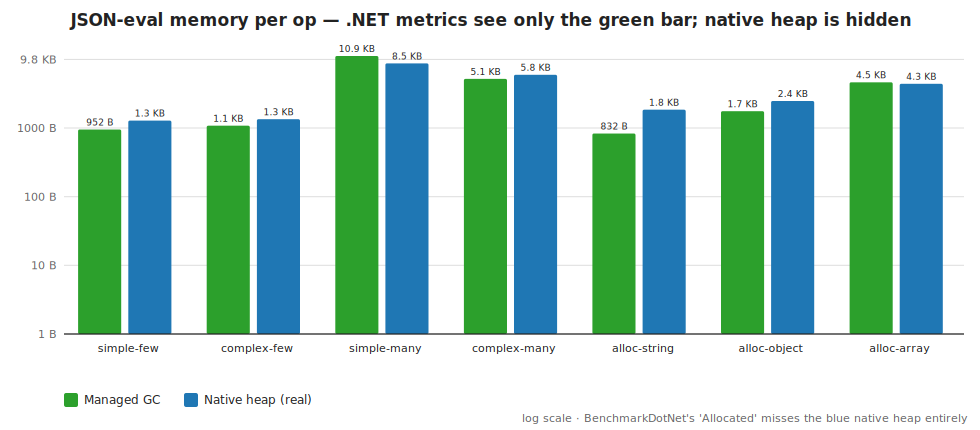

**Pure-eval** (compile-once / eval-many) — managed is 0 only for scalar expressions:

| Scenario | Managed GC B/op | Native heap B/op | ZenEngine GC B/op |
| --- | ---: | ---: | ---: |
| simple-few / complex-few / simple-many / complex-many | **0** | ~140–148 | ~928–976 |
| alloc-string | 264 | 593 | 1 040 |
| alloc-object | 552 | 833 | 1 960 |
| alloc-array  | 824 | 966 | 1 960 |

**JSON-eval** (parse context per call) — native hides most cost on its heap:

| Scenario | Managed GC B/op | Native heap B/op | ZenEngine GC B/op |
| --- | ---: | ---: | ---: |
| simple-few   | 880 | 1 281 | 1 008 |
| complex-few  | 1 008 | 1 344 | 1 104 |
| simple-many  | 11 120 | 8 732 | 1 416 |
| complex-many | 5 112 | 5 962 | 1 208 |
| alloc-string | 760 | 1 849 | 1 136 |
| alloc-object | 1 128 | 2 477 | 2 040 |
| alloc-array  | 2 040 | 4 400 | 2 088 |

- On the **pure** scalar hot path managed allocates **nothing**; on allocating
  expressions it allocates the result (264–824 B) — still less than native.
- On the **JSON** path, native pushes most allocation onto its **hidden heap** — BDN
  reports only ~150–560 managed B/op for native-json, but the *real* footprint
  (up to ~9 KB/op of serde-parsed context) only shows up via the counting allocator.
  **Don't trust GC-only numbers to compare against native code.**
- `GoRules.ZenEngine`'s GC column (native heap opaque) is the cost of getting a
  `ZenValue` *out* of the native engine per call (result `JsonBuffer` + parse); it is
  a steady ~1 KB/op on scalars and, notably, **far below legacy `GoRules.Zen` on the
  heavy allocating cases** (e.g. `heavy-map-1k` 61 KB vs GoRules 166 KB managed-side).
- Native heap retained after 20 000 evals: **0 bytes** — no leaks; everything
  transient is freed.

## Analysis: where native *could* win, and why it doesn't here

A native engine wins when **per-call native CPU work ≫ fixed interop + marshalling
cost**. Here the marshalling floor (result JSON round-trip ≈ hundreds of ns for
the manual path; async + context-serialize ≈ ~4 µs for GoRules) is comparable to
or larger than the expression work itself (148 ns–2.3 µs). So the managed JIT —
already very fast on arithmetic and dictionary lookups, and allocating zero on the
scalar hot path (only modest amounts when reshaping data) — matches or beats native.

Native becomes attractive when you (a) make expressions large enough that real
compute dominates, or (b) **batch** many evaluations per interop call so the
marshalling is amortized. Single-expression evaluation calls of realistic size do
not clear that bar — which is the whole point of this comparison.

## Heavy load: where native *does* beat managed

The chart trend is real — native catches up as work grows. A dedicated `HeavyBench`
pushes it: large arrays (1 000 elements), a 200-term arithmetic expression, and
map/filter over big result sets. (GoRules stays slow throughout — the crossover is
between **managed and manual-native**.)

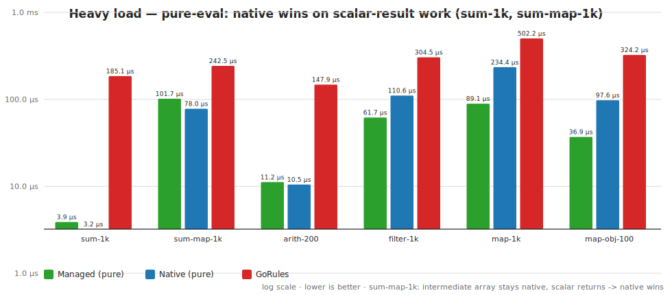

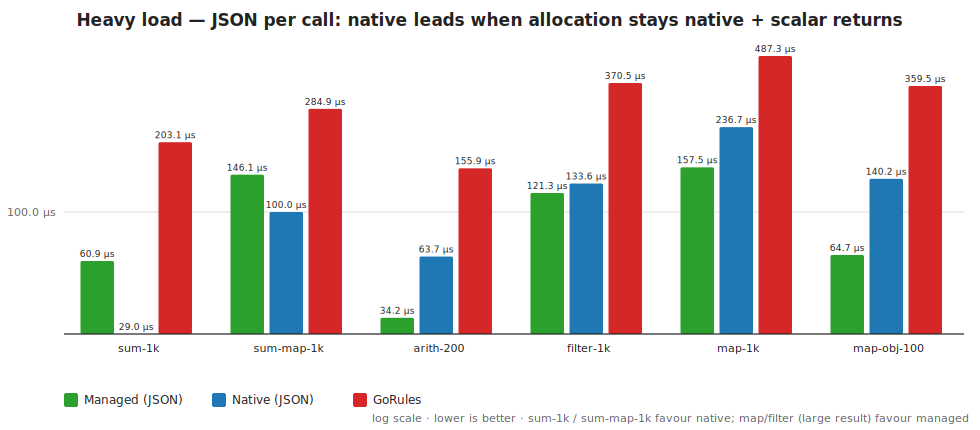

**Heavy pure-eval** (µs; ✅ = manual-native beats managed; **bold** = row winner):

| Scenario | Managed | Native (manual) | GoRules.Zen | GoRules.ZenEngine |
| --- | ---: | ---: | ---: | ---: |
| heavy-sum-1k (1 000-array sum, scalar) | 3.7 | **2.8** ✅ | 154.5 | 51.0 |
| heavy-sum-map-1k (intermediate 1 000-array, scalar) | 73.6 | **69.2** ✅ | 229.5 | 139.1 |
| heavy-arith-200 (200-term arithmetic, scalar) | **9.3** | 9.4 | 141.0 | 31.6 |
| heavy-filter-1k (~500-element result) | **56.6** | 98.1 | 269.4 | 162.8 |
| heavy-map-1k (1 000-element result) | **77.8** | 185.0 | 383.1 | 243.0 |
| heavy-map-objects-100 (100 objects result) | **31.7** | 78.3 | 251.2 | 146.7 |

**Heavy JSON-eval** (µs):

| Scenario | Managed | Native (manual) | GoRules.Zen | GoRules.ZenEngine |
| --- | ---: | ---: | ---: | ---: |
| heavy-sum-1k | 51.0 | **24.1** ✅ | 177.2 | 49.8 |
| heavy-sum-map-1k | 116.5 | **89.9** ✅ | 247.9 | 142.4 |
| heavy-arith-200 | **29.5** | 53.0 | 141.7 | 32.8 |
| heavy-filter-1k | **101.5** | 116.8 | 304.7 | 155.8 |
| heavy-map-1k | **131.3** | 202.2 | 417.6 | 261.4 |
| heavy-map-objects-100 | **56.7** | 118.2 | 278.0 | 148.9 |

ZenEngine note: because it parses the JSON context every call, `ZenEngine_Pure`
tracks managed's *JSON* column, not its pure column — e.g. `heavy-sum-1k` 51.0 µs
(pure) ≈ managed JSON 51.0 µs, vs managed pure 3.7 µs. On result-heavy work
(`map-1k`, `map-objects-100`) it pays to marshal the result back and trails both
managed and manual-native, though still ~1.6–1.9× faster than legacy `GoRules.Zen`.

The deciding factor is **where the allocation lives and what crosses back**:

- **`heavy-sum-map-1k` is native's best case — and it's mitigable.** `sum(map(...))`
  builds a 1 000-element *intermediate* array consumed by `sum` and never returned.
  Naively, managed materializes it on the GC heap and native wins by ~23%. But this
  is exactly the case for **stream fusion**: the managed `sum`/`avg`/`min`/`max`
  detect a `map`/`filter` source and iterate it lazily (a `ref struct ElementIter`),
  evaluating the body per element straight into the accumulator — **no intermediate
  array at all**. That drops managed from 101.7 → **73.6 µs**, now **≈ tied with
  native** (69 µs) on pure. (On JSON native still leads via `serde`, 90 vs 117 µs.)
  For contrast, BDN shows native's *managed* allocation at **40 B** here vs
  **53 136 B** for `heavy-map-1k` where the array *is* the result.
- **Native wins the pure scalar-compute case** (`heavy-sum-1k`): `sum(data)` has no
  intermediate to fuse, so native's tight eval loop + serde win (pure ~25% faster;
  JSON ~2× via `serde`).
- **Managed wins when the allocation is the result** (`heavy-map-1k`,
  `heavy-filter-1k`, `heavy-map-objects-100`): native must marshal the whole
  structure back across the boundary, which dominates. *More result allocations
  make managed's lead bigger, not smaller.*
- So the rule is symmetric and precise: **intermediate allocation that stays
  native + scalar result → native; large result that must cross back → managed.**
- **JSON reader optimized (3 iterations):** `ZenJson.Parse` went from `JsonDocument`
  → `Utf8JsonReader`+`ArrayPool` → a **UTF-16 `ReadOnlySpan<char>` parser** (reads
  the input string directly — no UTF-8 encode step, since `Utf8JsonReader` is
  UTF-8-only — and single-pass). Each step sped up **every** JSON path: standard
  scenarios ~25–45% faster overall, and `heavy-sum-1k` JSON **84 → 51 µs**. Native's
  `serde` still parses the 1 000-element array faster (≈24 µs); the remaining gap
  is `serde`'s maturity on bulk number
  tokenization, which is hard to close further without a custom UTF-8 number reader.

So: **native overtakes managed on compute-bound work with small results** (e.g.
`sum`/`reduce` over large inputs), and **managed dominates allocation-bound work**
and any path where the result must be marshalled. ([`results/heavy-bench.txt`](results/heavy-bench.txt))

---

# Part 2 — Variants & features

Everything added on top of the initial benchmark study.

## Engine variants

The comparison runs the **same Zen subset** through four engines (see the table
at the top):

- **`Zen.Managed`** — pure C#; the library under test. Zero native deps, zero
  GC alloc on the scalar hot path.
- **`GoRules.Zen`** (official NuGet) — the **legacy** official .NET binding
  (native Rust via UniFFI): async `Evaluate<T>` that re-parses the expression and
  re-serializes the context every call. The "unmanaged engine via interop" path
  this study originally weighed managed against.
- **`GoRules.ZenEngine`** (official NuGet) — the **newer** official .NET binding of
  the *same* Rust core, with a synchronous `ZenExpression.Compile` +
  `Evaluate(JsonBuffer)` API. Added to test whether the official engine's 20–34×
  gap (measured through `GoRules.Zen`) is the engine or the binding — verdict in
  [Part 3](#part-3--second-official-binding-goruleszenengine).
- **`Zen.Native` + `Zen.Interop`** — a *reference* manual Rust `cdylib` + P/Invoke
  wrapper (not a published package). It has a lean raw-bytes C ABI and a **counting
  global allocator** (so its native heap is measurable — the thing .NET metrics
  cannot see). It's included to isolate "native eval speed + minimal interop" —
  i.e. how fast native *could* be with an ideal binding — which is why it beats the
  official libraries on every cell.

All four are exercised by the same `Scenarios` matrix (simple/complex × few/many
+ allocating) and the same parity battery.

## Resource limits (deterministic compute/memory budgets)

The managed engine has a count-based resource budget (`ZenLimits`) so an
evaluation behaves **identically regardless of CPU load** — never a wall-clock
timeout that fails a normal expression on a busy machine.

```csharp
var expr = ZenExpression.Compile("sum(map(big, # + 1))");
var result = expr.Evaluate(context, ZenLimits.Default);   // enforces the budget
// throws ZenLimitException if a budget is exceeded
```

| Budget | Counts | Default | Strict |
| --- | --- | --- | --- |
| `MaxSteps` | array elements processed by iterating ops (`sum`/`avg`/`min`/`max`/`map`/`filter`/`some`/`all`/`in`) | 1,000,000 | 1,000 |
| `MaxAllocations` | structural allocs (arrays/objects/strings) | 1,000,000 | 10,000 |
| `MaxBytes` | estimated allocated bytes | 256 MB | 4 MB |
| `MaxSourceLength` | source text (parse guard) | 1 MB | 64 KB |
| `MaxParseDepth` | parser recursion depth | 1,000 | 200 |

- **Opt-in for eval:** `Evaluate(ctx)` enforces nothing (the fast path the
  benchmarks measure); pass a `ZenLimits` to sandbox untrusted input. Parse guards
  are on by default (cheap). When off, the guards add **no measurable overhead**.
- **Near-zero enforcement overhead:** `MaxSteps` is charged **O(1) up-front** at
  array-iterating ops, not per AST node; static work is bounded by
  `MaxSourceLength` at parse time. So non-iterative expressions pay nothing to
  enforce limits. Measured (`LimitsBench`, `Evaluate` off vs on):

  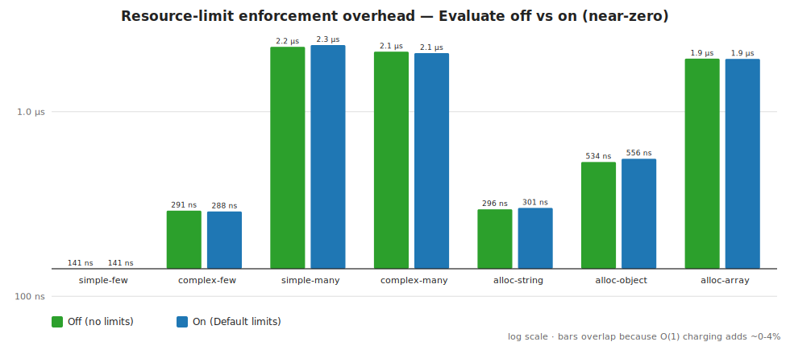

  | Scenario | Off | On (Default) | overhead |
  | --- | ---: | ---: | ---: |
  | simple-few   | 141 ns | 141 ns | ~0% |
  | complex-few  | 291 ns | 288 ns | ~0% |
  | simple-many  | 2 243 ns | 2 294 ns | +2% |
  | complex-many | 2 113 ns | 2 075 ns | ~0% |
  | alloc-string | 296 ns | 301 ns | +1% |
  | alloc-object | 534 ns | 556 ns | +4% |
  | alloc-array  | 1 937 ns | 1 931 ns | ~0% |

  (An earlier per-node counter charged 5–12%; the O(1) iteration design brought it
  to within noise.) Limits are **managed-only** — the native path is just a lib
  call, and you cannot budget someone else's compiled `.so` from the outside.
- **DoS-safe:** the language has no user-defined recursion, so there are no
  infinite loops; iterating operations are bounded by `MaxSteps`, allocations by
  `MaxAllocations`/`MaxBytes`. A hostile expression or huge input array aborts
  deterministically instead of hanging or OOMing.
- Aborts throw `ZenLimitException`. Covered by `LimitTests`.

## Cold-start & footprint overhead

The per-op benchmarks in Part 1 measure the steady-state hot path. The
`--overhead` report measures the fixed cost you pay once:

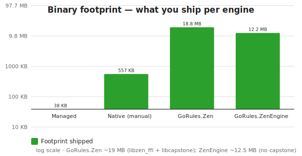

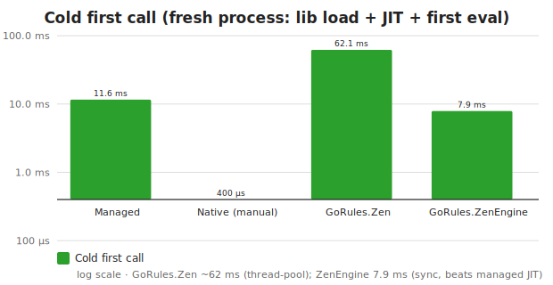

| | Managed | Native (manual) | GoRules.Zen | GoRules.ZenEngine |
| --- | ---: | ---: | ---: | ---: |
| Binary footprint | 38.5 KB (`Zen.Managed.dll`) | +548 KB (`libzen_native.so`) | **~19 MB** (`libzen_ffi` 12.5 MB + `libcapstone` 6.7 MB) | **~12.5 MB** (`libzen_uniffi` 12.4 MB; no capstone) |
| Native `dlopen` | n/a (pure managed) | ~0.1 ms | (included below) | (included below) |
| Cold first call | ~8.9 ms (JIT) | ~0.4 ms | **~59.7 ms** (dlopen 12 MB + UniFFI init + thread-pool) | **~7.3 ms** (sync: lib load + first compiled-eval) |
| Warm eval (simple) | ~132 ns | ~248 ns | ~3.7 µs | ~1.2 µs |

Takeaways:
- **Pure managed has the smallest footprint** (38.5 KB, no native deps) and no
  `dlopen`; the legacy official engine ships ~19 MB and pays a ~59.7 ms cold-start,
  while the newer `GoRules.ZenEngine` ships ~12.5 MB (no capstone) and is cold in
  **~7.3 ms** — faster than managed's JIT (~8.9 ms), because its first call is a
  native eval with no expression JIT.
- The manual native engine is a useful middle ground: 548 KB, sub-ms cold, and
  fast warm — but it still crosses the interop boundary per call.
- `GoRules.ZenEngine`'s warm ~1.2 µs is ~3× faster than `GoRules.Zen`'s ~3.7 µs
  (synchronous, no thread-pool floor) — but still ~9× managed's ~132 ns.
- Cold numbers are one-shot per fresh process (min of 5 runs); warm is steady-state.

## Strict-compat mode

`Zen.Tests/GorulesParityTests` compares our engine against the **official GoRules**
reference on the full case battery. Compat is controlled by `ZEN_STRICT_COMPAT`:

- **Off (default):** if GoRules rejects an expression our engine accepts, the case
  is soft-skipped — so extending the language beyond the reference does not fail
  the suite.
- **On (`ZEN_STRICT_COMPAT=1`):** a GoRules rejection **fails** unless the case is
  on the `KnownSupersetCases` allowlist. This catches *unexpected* regressions on
  the shared subset while the language grows.

Strict mode surfaced 6 features our engine extends beyond GoRules (now
allowlisted): `concat()`, negative indexing (`items[-1]`), string relational
comparison (`'a' < 'b'`), `replace()`, `substring()`, and `'needle' in 'haystack'`.

## Test coverage

374 tests, green in both default and strict modes:

- **`ParityTests`** — managed ↔ manual-native agree on the full battery
  (simple/complex × few/many + allocating), plus the managed pure vs JSON paths.
- **`GorulesParityTests`** — managed ↔ official `GoRules.Zen` reference (see strict mode above).
- **`ZenEngineParityTests`** — managed ↔ official `GoRules.ZenEngine` (the second
  binding), through its compiled `ZenExpression.Compile` path — same shared-subset /
  strict-compat semantics, confirming the newer binding's wiring agrees with managed.
- **`LimitTests`** — step/allocation/byte/parse-depth/parse-length budgets abort
  deterministically, including a hostile-input case and a deterministic-repeat check.

## Language subset

Implements standard-mode Zen: number/string/bool/null/array/object literals,
arithmetic (`+ - * / % ^`), comparisons, `and/or/not` (and `&& || !`), ternary,
`??`, member/index access (with negative indices and optional-chaining), `in` /
`not in` with ranges (`[a..b]`, `(a..b]`, …), and ~30 built-ins including
closures via `#` (`map`, `filter`, `some`, `all`, `sum`, …). Operator precedence
follows the published GoRules table. Precedence is exercised by the parity suite
against the official engine. Out of scope: template/backtick strings, string
slicing, assignment statements, decision-graph (JDM) evaluation.

---

# Part 3 — Second official binding: `GoRules.ZenEngine`

GoRules ships **two** .NET NuGet bindings of the *same* native Rust core, and the
study originally only exercised one. Adding the second resolves a question the
TL;DR raises but can't answer on its own: **is the official engine's 20–34× gap the
engine, or the binding?**

| Binding | API shape | Per-call taxes |
| --- | --- | --- |
| `GoRules.Zen` (legacy) | async `ZenExpression.Evaluate<T>(expr, context)` | re-parse expression; `JsonSerializer.Serialize` the context object; `Task` + thread-pool dispatch |
| `GoRules.ZenEngine` (newer) | sync `ZenExpression.Compile(expr).Evaluate(JsonBuffer)` | expression compiled once; context is raw `JsonBuffer` bytes; no thread-pool |

`GoRules.ZenEngine` removes *both* binding taxes the README blamed for the gap — it
precompiles the expression and evaluates synchronously. Measured on the same suite:

- **Throughput:** `GoRules.ZenEngine` is **~3–12× faster than `GoRules.Zen`** on the
  standard scenarios (`simple-few` 1.19 µs vs 3.72 µs; `simple-many` 8.83 µs vs
  59.2 µs) and **~1.6–4.5× faster on heavy**. The 20–34× penalty was the *binding*, not
  the engine.
- **But it still can't reach managed.** `ZenEngine_Pure`'s context is a `JsonBuffer`
  of raw bytes that Rust re-parses *every call* — there is no "hold the parsed
  context" path. So on the heavy scalar case it lines up with managed's *JSON*
  column, not its pure column (`heavy-sum-1k`: ZenEngine 51 µs ≈ managed JSON 51 µs,
  vs managed pure 3.7 µs). On result-heavy work it pays to marshal the result back
  and trails both managed and manual-native.
- **Cold start:** synchronous, no thread-pool spawn → **~7.3 ms** first call (vs
  `GoRules.Zen`'s ~59.7 ms, and even below managed's ~8.9 ms JIT). Footprint ~12.5 MB
  (no `libcapstone`).
- **Memory:** its managed-side allocation is steady (~1 KB/op on scalars — the cost
  of extracting a `ZenValue` from the native result) and, on heavy allocating cases,
  **well below `GoRules.Zen`** (`heavy-map-1k` 61 KB vs 166 KB managed-side). Native
  heap stays opaque.

**Verdict:** the newer binding proves the official Rust engine is not inherently
slow — most of the headline gap was `GoRules.Zen`'s async, no-precompile API. But a
native binding can never skip the one thing a managed engine structurally avoids:
serializing the context to cross the boundary. So managed pure-eval (context held as
a live in-process object, zero per-call JSON) still wins, and `GoRules.ZenEngine` —
for all its improvements — benchmarks like a *fast JSON path*, not like managed's
pure path. ([`results/bench-full.txt`](results/bench-full.txt),
[`results/heavy-bench.txt`](results/heavy-bench.txt),
[`results/overhead.txt`](results/overhead.txt))
